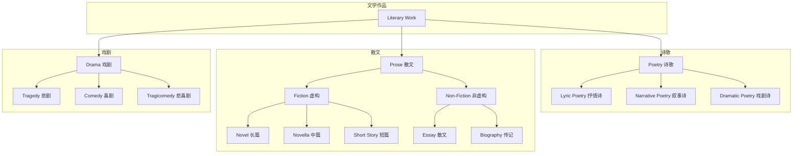
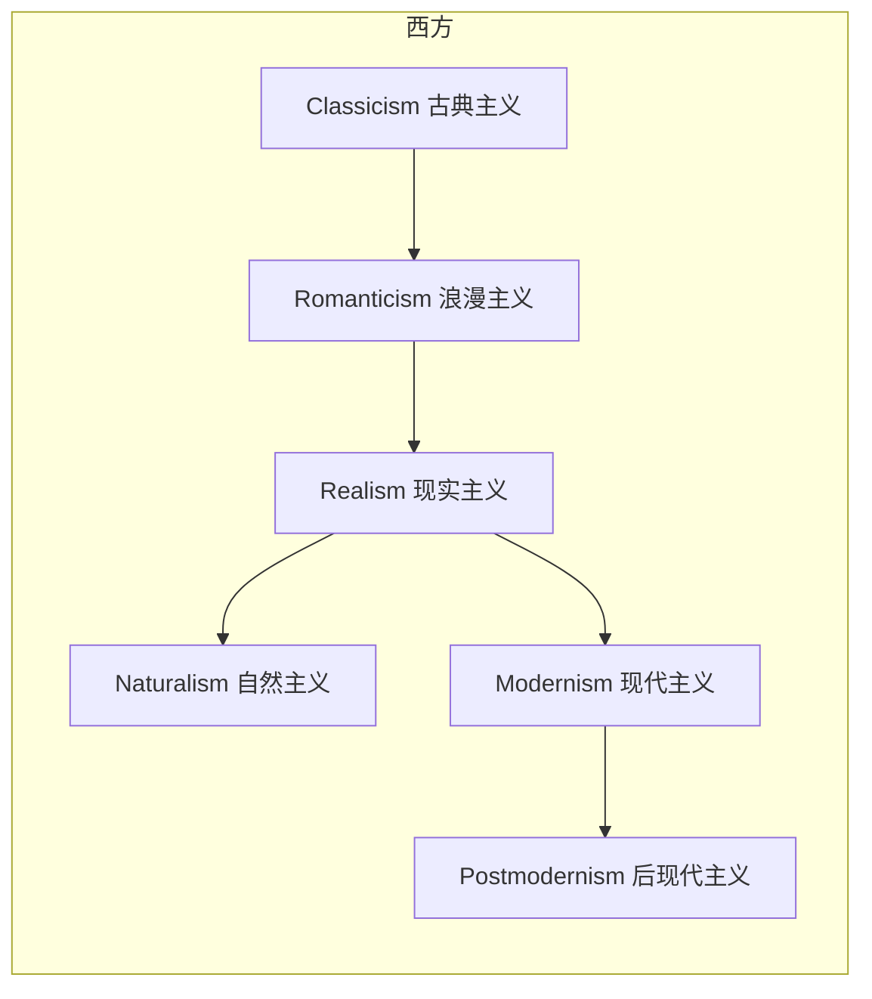
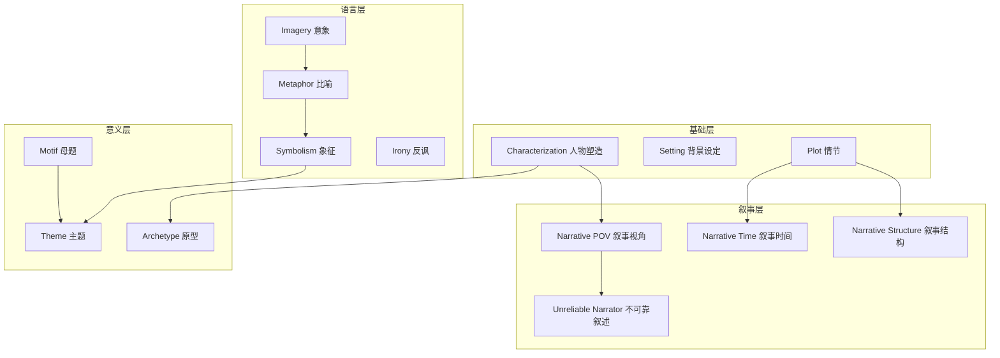

# 概念图（依赖关系 & 学习路线）

> 用来回答"先学什么 → 再学什么"以及"这个概念和那个概念什么关系"。

---

## 1. 体裁继承关系（Genre Hierarchy）

---

## 2. 流派演化（Movement Evolution）

### 流派特征对比
| 流派 | 核心价值 | 形式特征 | 代表作家 |
| --- | --- | --- | --- |
| 古典主义 | 理性、秩序、典范 | 遵循三一律、格律严整 | 拉辛、莫里哀 |
| 浪漫主义 | 情感、个性、自然 | 抒情强烈、形式自由 | 拜伦、雨果、济慈 |
| 现实主义 | 客观、真实、社会 | 细节真实、典型环境 | 巴尔扎克、托尔斯泰、狄更斯 |
| 现代主义 | 主观、实验、碎片 | 意识流、多视角、时空跳跃 | 乔伊斯、伍尔夫、卡夫卡 |
| 后现代主义 | 解构、戏仿、自反 | 元小说、互文、不确定性 | 博尔赫斯、卡尔维诺、品钦 |

---

## 3. 分析工具依赖图（Module Dependencies）

---

## 4. 学习路线建议

### 4.1 入门路线（从体裁入手）
1. **体裁基础**：Fiction → Poetry → Drama（了解三大类的基本特征）
2. **分析工具**：Narrative POV → Characterization → Theme（掌握最常用的分析视角）
3. **修辞基础**：Metaphor → Symbolism → Irony（理解语言层面的技巧）

### 4.2 进阶路线（从流派入手）
1. **流派演化**：Classicism → Romanticism → Realism → Modernism
2. **形式深入**：Sonnet → Stream of Consciousness → Free Verse
3. **主题分析**：Identity → Coming-of-Age → Mortality

### 4.3 实战路线（从作品入手）
1. 选一部作品 → 先看体裁归属
2. 识别使用了哪些 modules（叙事/修辞/主题）
3. 定位流派与文学史位置
4. 与同类作品对比

---

## 5. 跨领域联系

### 与数学的类比
| 文学概念 | 数学类比 | 说明 |
| --- | --- | --- |
| 体裁（Genre） | 代数结构（Group/Ring/Field） | 都是带有特定"公理"的类定义 |
| 流派（Movement） | 结构演化链 | Semigroup → Monoid → Group |
| 修辞手法（Rhetoric） | 运算/态射 | 都是可复用的"操作" |
| 作品分析 | 验证公理是否满足 | 看作品是否符合某体裁/流派的定义 |

### 与神经网络的类比
| 文学概念 | 神经网络类比 | 说明 |
| --- | --- | --- |
| 作品（Works） | 模型（Models） | 都是具体的"实例" |
| 横切模块（Modules） | 共用模块（ELBO/Attention） | 跨实例可复用的组件 |
| 体裁（Genre） | 模型族（AE家族/Transformer） | 同一类的抽象 |

---

## 6. 常见问题导航

| 问题 | 去哪里找 |
| --- | --- |
| 什么是意识流？ | [structures/forms/StreamOfConsciousness.md](structures/forms/StreamOfConsciousness.md) |
| 怎么分析小说的叙事视角？ | [modules/NarrativePOV.md](modules/NarrativePOV.md) |
| 浪漫主义和现实主义有什么区别？ | [structures/periods/Romanticism.md](structures/periods/Romanticism.md) + [structures/periods/Realism.md](structures/periods/Realism.md) |
| 什么是不可靠叙述者？ | [modules/UnreliableNarrator.md](modules/UnreliableNarrator.md) |
| 怎么识别作品中的象征？ | [modules/Symbolism.md](modules/Symbolism.md) |
